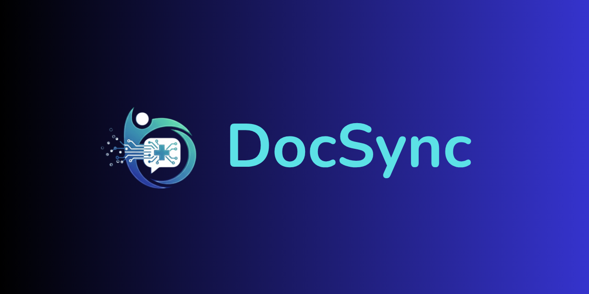

# DocSync



A modern Flutter application for seamless doctor-patient consultations.

---

## ✨ Detailed Tech Stack

- **Frontend:**
  - **Flutter:** The core framework for building the cross-platform mobile application from a single codebase.
  - **Dart:** The programming language used for all Flutter development.
- **State Management:**
  - **Flutter Riverpod:** A reactive state management library that helps in managing application state in a simple, scalable, and testable way.
- **Backend & Database:**
  - **Supabase:** An open-source Firebase alternative used for the backend. It provides a PostgreSQL database, authentication, and auto-generated APIs.
- **Real-time Communication:**
  - **Agora:** A real-time engagement platform providing APIs for high-quality video and voice calls.
- **Artificial Intelligence:**
  - **Google Gemini:** A family of multimodal AI models used for the AI-powered symptom analysis feature.
- **Routing:**
  - **GoRouter:** A declarative routing package for Flutter that simplifies navigation, handles deep linking, and provides a structured way to manage routes.
- **Key Dependencies:**
  - **http:** For making simple HTTP requests.
  - **intl:** For internationalization and localization.
  - **image_picker:** For selecting images from the device gallery.
  - **permission_handler:** For requesting and checking app permissions.

---

## 🎯 Motivation

In today's fast-paced world, accessing healthcare services can be challenging due to geographical barriers, time constraints, and the increasing burden on healthcare systems. Patients often face long waiting times and difficulty in scheduling appointments, while doctors struggle to manage their schedules efficiently. DocSync aims to bridge this gap by providing a comprehensive, user-friendly telehealth platform.

## 📝 Problem Scope & Statement

**Problem:** The lack of an integrated and accessible platform for remote medical consultations leads to inefficiencies for both patients and doctors. Patients need a simple way to find doctors, book appointments, and attend video consultations. Doctors require a system to manage their availability, conduct secure video calls, and maintain patient records.

**Scope:** DocSync is a Flutter-based mobile application designed to solve these challenges by offering:

- **User Authentication:** Secure registration and login for patients and doctors.
- **Doctor Discovery:** A searchable directory of doctors with detailed profiles.
- **Appointment Booking:** An intuitive system for scheduling, viewing, and managing appointments.
- **Real-time Video Calls:** High-quality, secure video consultations powered by Agora.
- **AI-Powered Symptom Analysis:** An AI assistant (powered by Google's Gemini) to help patients analyze their symptoms and find the right specialist.
- **Prescription Management:** A system for doctors to issue and patients to view digital prescriptions.

---

## 🚀 How to Run This Project

To get a local copy up and running, follow these simple steps.

### Prerequisites

- Flutter SDK (version 3.9.0 or higher)
- A Supabase account for the backend.
- An Agora account for video calling credentials.
- A Google AI API key for the Gemini integration.

### Installation & Setup

1. **Clone the repo:**

   ```sh
   git clone https://github.com/muntasirhossain2003/DocSync.git
   cd DocSync
   ```

2. **Install packages:**

   ```sh
   flutter pub get
   ```

3. **Set up environment variables:**

   Create a `.env` file in the root of the project and add your credentials for Supabase, Agora, and Google AI.

   ```env
   SUPABASE_URL=YOUR_SUPABASE_URL
   SUPABASE_ANON_KEY=YOUR_SUPABASE_ANON_KEY
   AGORA_APP_ID=YOUR_AGORA_APP_ID
   GEMINI_API_KEY=YOUR_GEMINI_API_KEY
   ```

4. **Run the app:**

   ```sh
   flutter run
   ```

---

## 📊 Presentation

You can see the presentation of our project here.

You can also read the presentation PDF: [docsync_presentation](docs/docsync_presentation.pdf)


